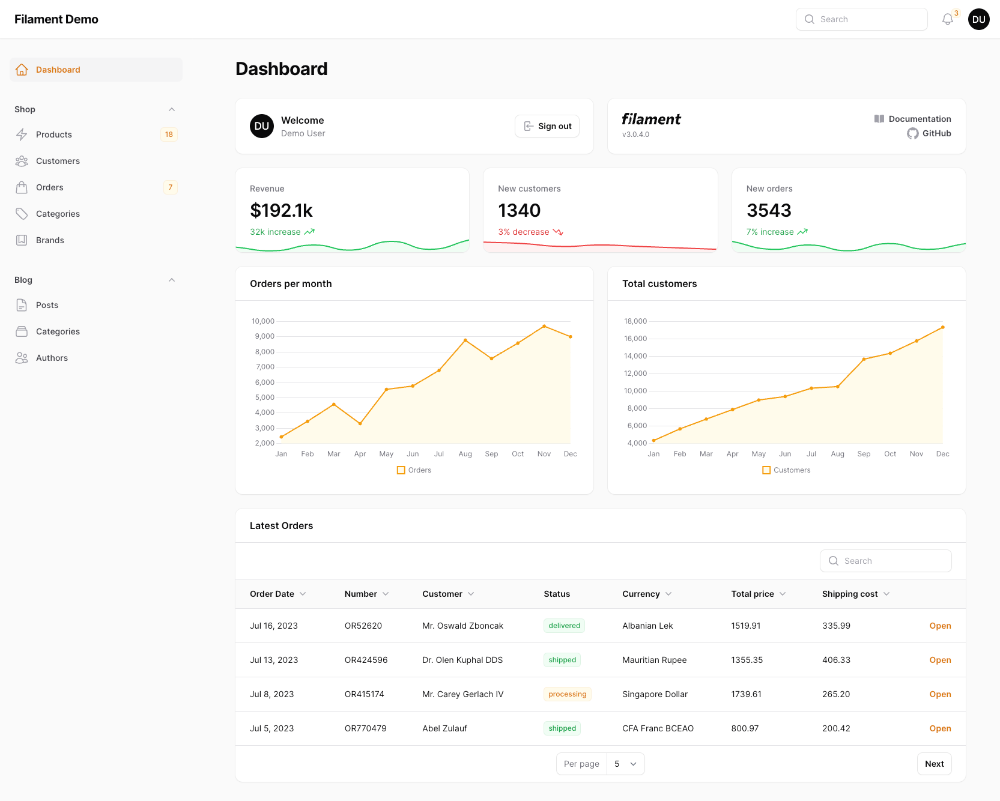
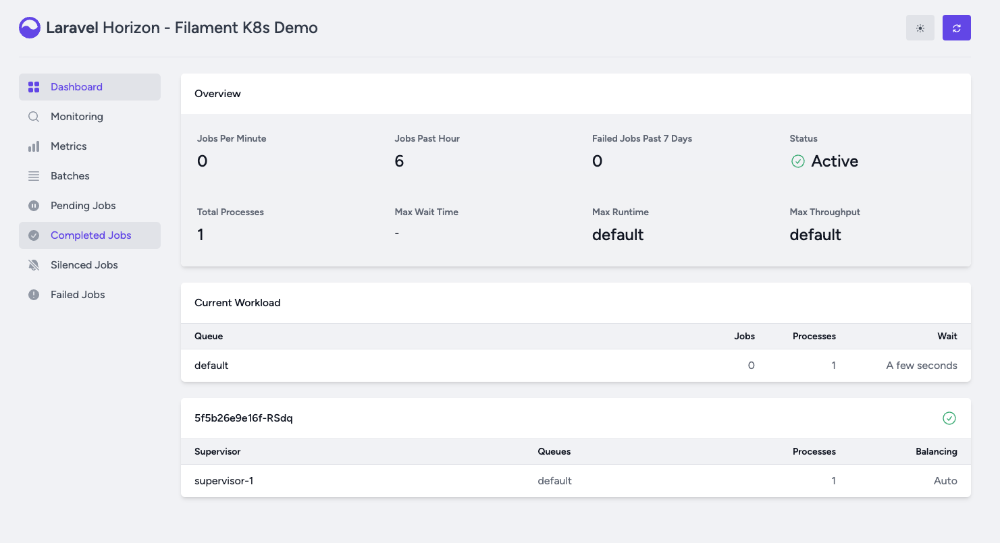

# Laravel Filament + k8s

Project demo for my Laravel and Kubernetes workshop with deployment on Azure Kubernetes Service and DigitalOcean Kubernetes.

This project is a simple demo. I chose to use FrankenPHP with an app server, but alternatively, you could use RoadRunner, Swoole, or Open Swoole. In this setup, there is a Docker Compose file that initializes services locally.

## Start here
 * [Create AKS Cluster](./docs/create-aks-cluster.md)

## Included Items

* [PHP 8.3](https://www.php.net/releases/8.3/pt_BR.php)
* [Laravel](https://laravel.com/)
* [Laravel Octane](https://laravel.com/docs/10.x/octane)
* [Laravel horizon](https://laravel.com/docs/10.x/horizon)
* [Laravel Filament](https://filamentphp.com/)
* [FrankenPHP](https://frankenphp.dev/)
* [AKS](https://azure.microsoft.com/pt-br/products/kubernetes-service)
* [DOKS](https://www.digitalocean.com/products/kubernetes)

## Upcoming Meetings

This repository is the initial part of something larger. We will have a project with services developed in NodeJS (NestJS), Go, and PHP (Laravel), all containerized and deployed in a Kubernetes cluster.

## Credits

* [Fábio Assunção](https://github.com/fabioassuncao)
* [All Contributors](../../contributors)
